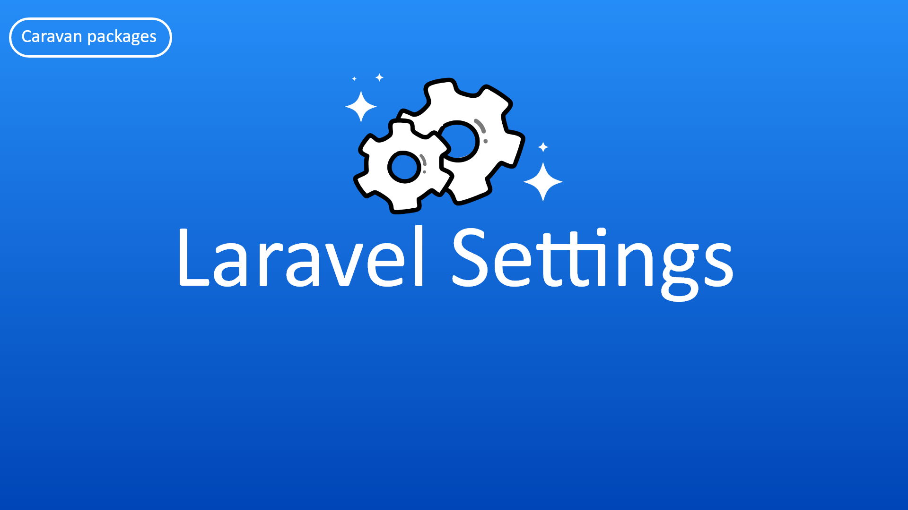

<h2 align="center">Supporting Laravel Settings Package</h2>

- [Become sponsor on Patreon](https://www.patreon.com/yazan_alnughnugh).
- [One-time donation via crypto-currencies](https://github.com/yazan-alnugnugh/laravel-datatable/blob/master/_docs/Donations/crypto/index.md).


# Introduction

<p align="center">
    
</p>

**do you would like to add settings to your website or to your model this package created for that.**

The Laravel Settings created to allow you to add general settings to your website
 simple and easy way also you can add settings for the specific model item,
  Let's start using it in simple steps.


## Official Documentation

 Documentation for Laravel Settings can be found here  [here](https://packages.tourismcaravan.com/docs/3/laravel-settings)
 


## Quick Example


### General Setting

we will call the ```set``` method from ```Setting``` class and set key and value simply
```php

$setting =  \Setting::set('age', 18);

```

Here we retrieve data from ```Setting```

```php

$setting =  \Setting::get('age');
// 18

```

### Model Setting

we can set setting for specific item of Model  as below

```php
$user = User::find(1);
$user->setSetting('age', 18);
```

Here we retrieve Setting from model 

```php

$user->getSetting('age');
// 18
```

also, we can retrieve Setting as a group 
```php

$user->getSettingGroup('default');
//['age' => 18]
```

### Tests

to start the Test Laravel settings package we can use the composer command.

```push
composer test
```


