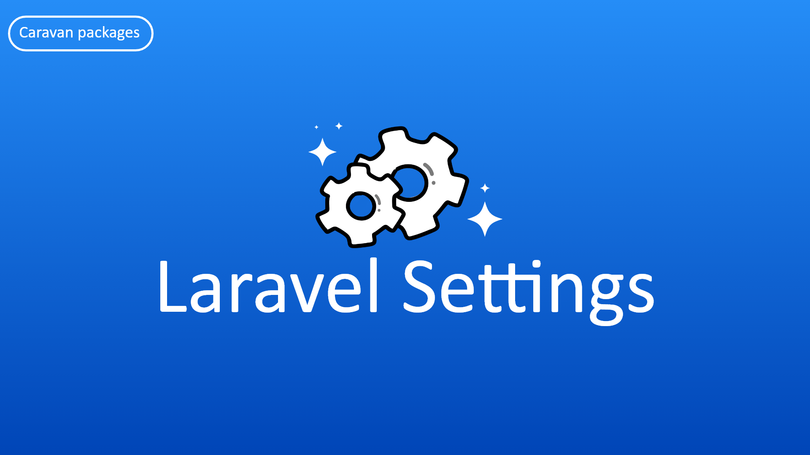

<h2 align="center">Supporting Laravel Settings Package</h2>

- [Become sponsor on Patreon](https://www.patreon.com/yazan_alnughnugh).
- [One-time donation via crypto-currencies](https://github.com/yazan-alnugnugh/laravel-datatable/blob/master/_docs/Donations/crypto/index.md).

# Introduction

    

**do would like to add settings to your website or to your model this package created for that.**

The Laravel Settings created to allow you to add general settings to your website
 simple and easy way also you can add settings for the specific model item,
  Let's start using it in simple steps.

## Official Documentation

 Documentation for Laravel Settings can be found here  [here](https://packages.tourismcaravan.com/docs/3/laravel-settings)
 

## Demo

 [DataTable Demo](https://packages.tourismcaravan.com/data-table)

## Quick Example

